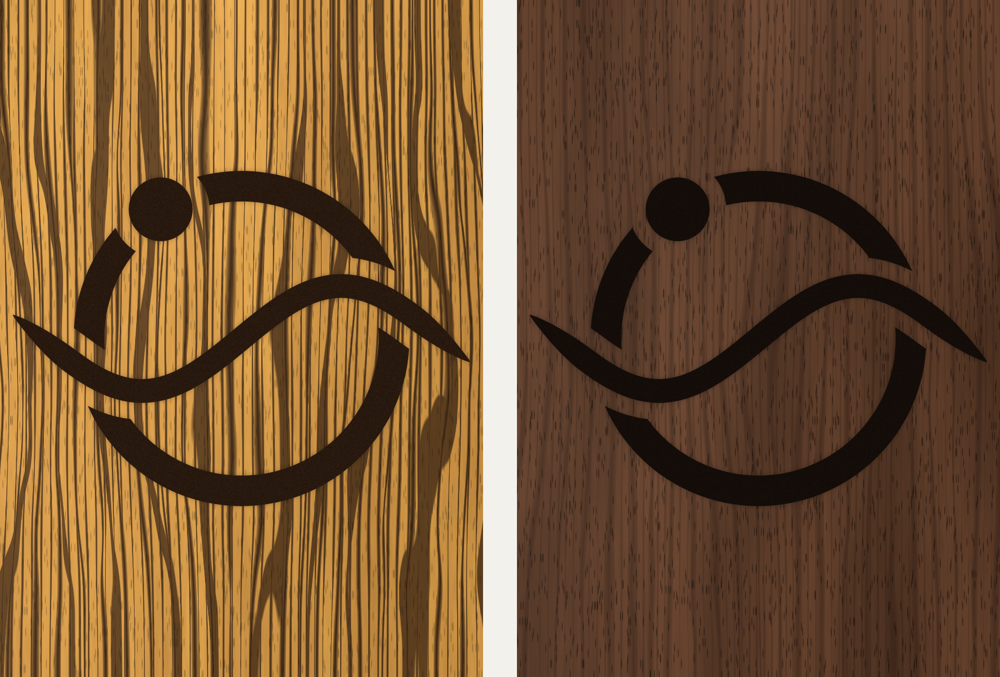

# Branding: the Space Coast Synthesizers mark



The **orbit-wave mark** for Space Coast Synthesizers, the maker name on the
instrument. "Woody" is the project's working name and is not part of the
brand.

It is a ring in orbit (a planet's path, with a moon on it) and a sine wave
running through it (the sound). The wave is drawn as a brush stroke that
lifts off into a point at both ends. The mark is symbol-only by design, with
no lettering, because small text does not survive laser etching into
figured wood.

## Files

Everything under `export/` is **generated** by [`build.py`](build.py). Do not
edit it by hand: change `SPEC` in `build.py` and rebuild.

| File | Use |
|---|---|
| [`export/scs-orbit-wave-mark.svg`](export/scs-orbit-wave-mark.svg) | **Production artwork.** Exact size in mm, filled outlines only (no strokes, no fonts). Black is the etched area. Send this to the laser shop. |
| [`export/scs-orbit-wave-mark.dxf`](export/scs-orbit-wave-mark.dxf) | The same outlines as five closed polylines, units mm, for laser or CAM software that prefers DXF. |
| [`export/spec.json`](export/spec.json) | Every construction number, plus the measured overall size. |
| [`export/print/scs-mark-test-print-100pct.pdf`](export/print/scs-mark-test-print-100pct.pdf) | US Letter. Print at 100 % and measure the 50 mm bar first. It includes the mark at actual size, a cut-out outline for checking position, the mark on a panel outline, and 45 mm / 36 mm comparisons. |
| [`export/png/scs-mark-black.png`](export/png/scs-mark-black.png), [`scs-mark-white.png`](export/png/scs-mark-white.png) | Transparent PNGs, 2000 px wide, for screens and documents on light or dark backgrounds. |
| [`export/renders/`](export/renders/) | Simulated laser etch at true scale on procedurally generated bocote and dark walnut textures. **Illustrative only**: the wood is synthetic, not photographed. |

## Geometry

All dimensions are in mm, at the size the mark is etched.

| | |
|---|---|
| Overall | **54.0 × 39.6** |
| Ring | 36.0 centreline diameter, 3.6 band |
| Wave | One sine cycle, amplitude 6.2, 2.8 wide in the body, brush-tapered to a point over the last 9.0 at each end, 54.0 tip to tip |
| Moon | Ø 7.52, on the ring at upper left (−122° from the +x axis) |
| Clearances | 2.0 around the wave where it crosses the ring, 2.0 around the moon |
| Parts | 5 separate filled shapes: 3 ring arcs, the wave, the moon |

The mark is laid out for the controller's top panel, in the section between
the key runs and the mouthpiece end. Its width is taken from the enclosure
envelope in [ADR 0009](../docs/decisions/0009-enclosure-construction.md).
`PANEL_WIDTH` in `build.py` is used only for the test print and the renders;
**if ADR 0009's width changes, update `PANEL_WIDTH` and check the side margin
in `spec.json`**, because the 54 mm mark does not scale with it.

The smallest feature is the 2.0 mm clearance, which is safe for a laser in
wood. The pointed wave tips will come out slightly soft over their last
~1 mm when etched; that is expected, and it reads as a brush lift.

## Etching notes

- Etch the black areas as **filled raster**, not vector outlines. About
  0.3–0.5 mm deep reads well.
- **Mask the panel** (paper transfer tape or masking tape) before etching.
  Resinous woods smoke-stain around an etch, and the mask takes the stain.
- Etch **after final sanding and before finishing**, so the finish seals the
  etch along with the surface.
- **Test on an offcut of the same board first** to set the depth and check
  that the tips come out cleanly.

## Rebuilding

```sh
pip install -r branding/requirements.txt
python3 branding/build.py
```

The build is **deterministic**: with `SPEC` unchanged it rewrites every file
byte for byte (no timestamps in the PDF or DXF, seeded textures). A diff
under `export/` therefore always means the mark itself changed.

## Licence

**TBD.** [`LICENSE`](../LICENSE) maps every other top-level directory to a
licence, and `branding/` is not in it yet. A brand mark is usually kept out of
the share-alike licences so that forks do not ship under the original maker's
name. What decides it: whether derivatives may carry the Space Coast
Synthesizers mark. Until that is decided and recorded in `LICENSE`, the mark
is not covered by the repository's open licences.
