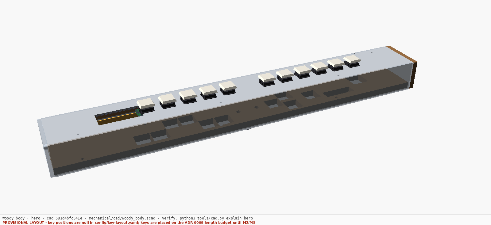
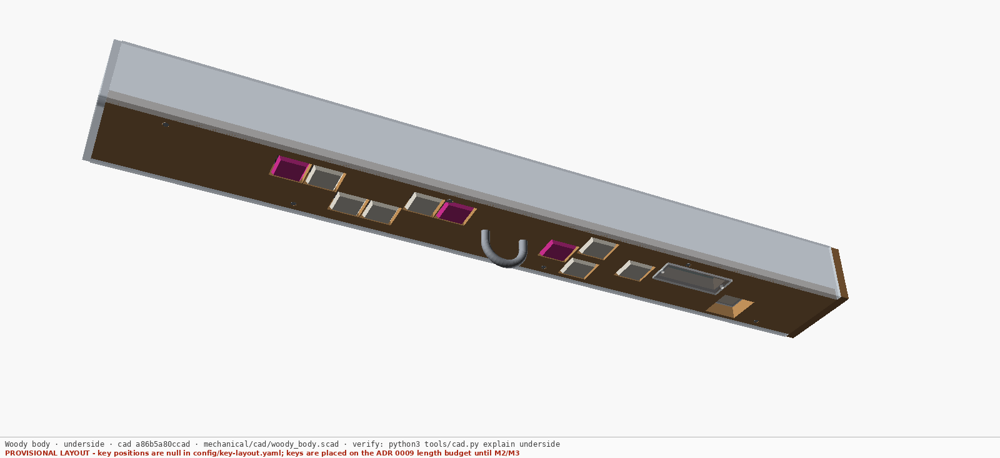
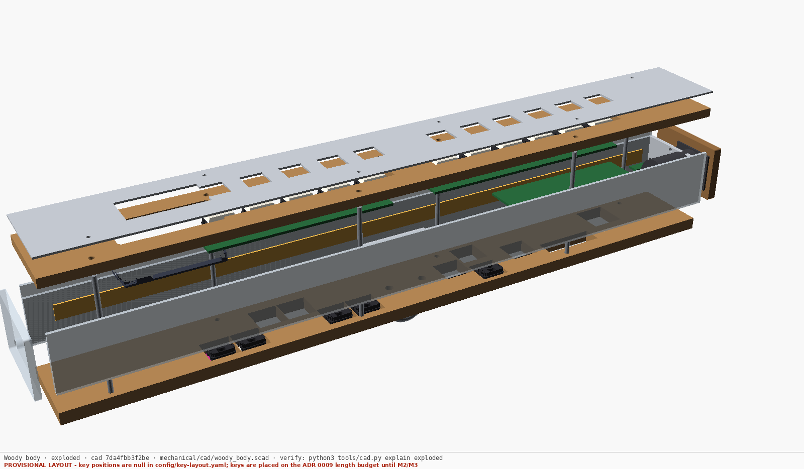
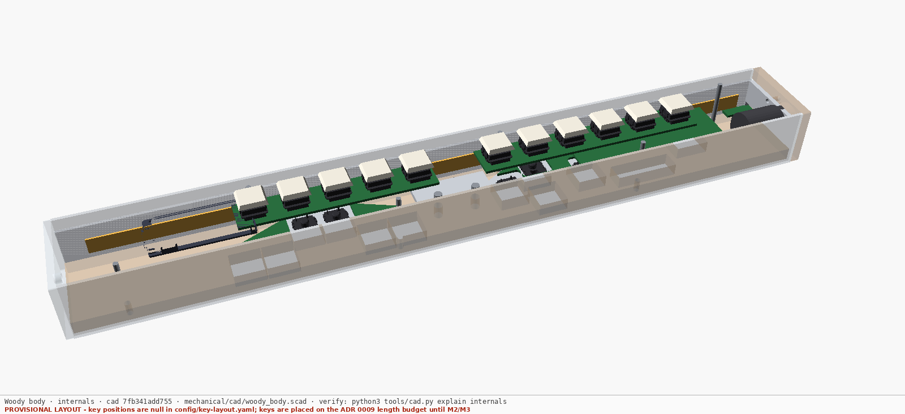
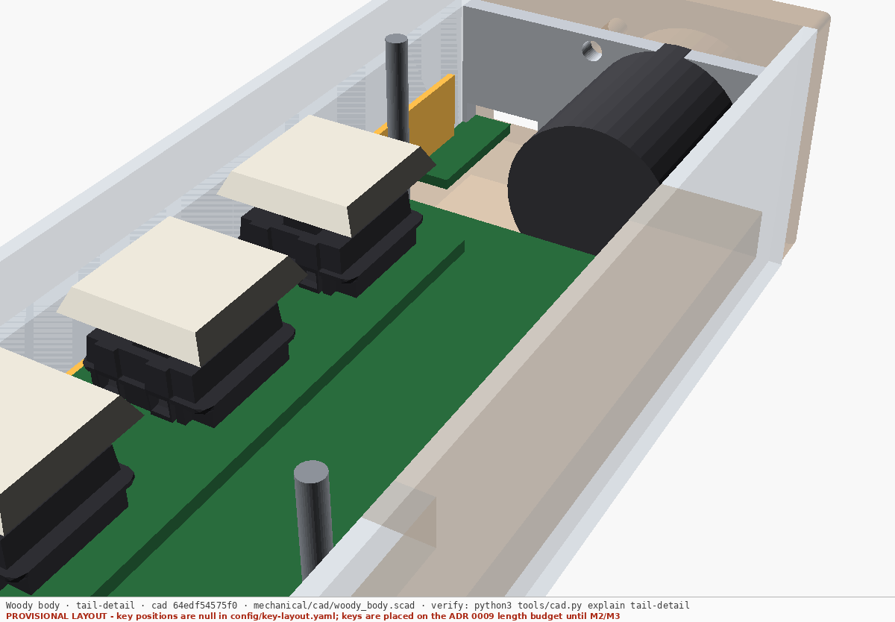
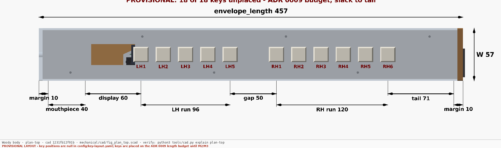
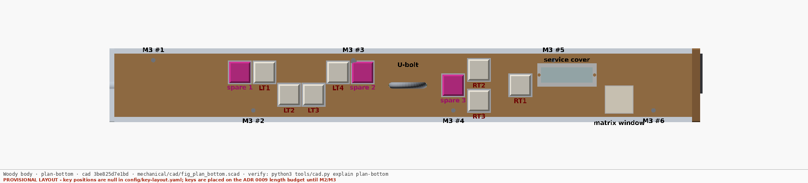
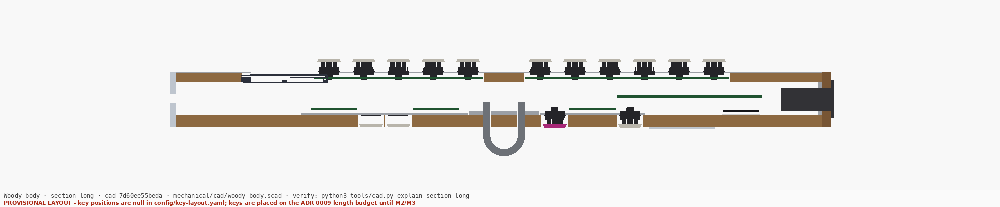
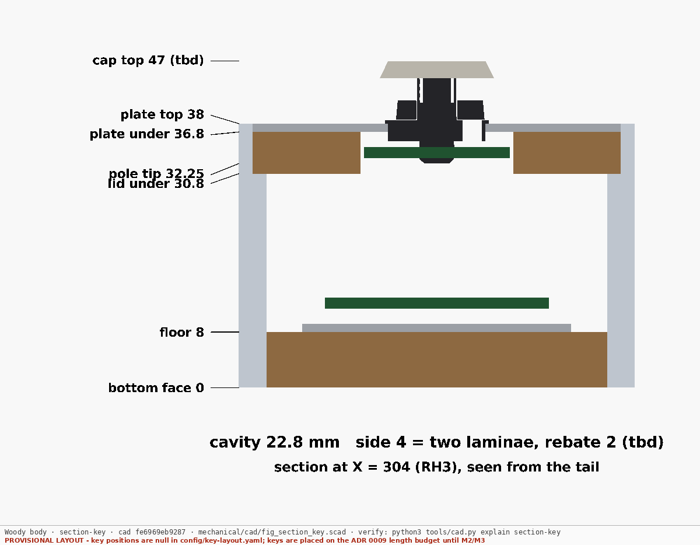
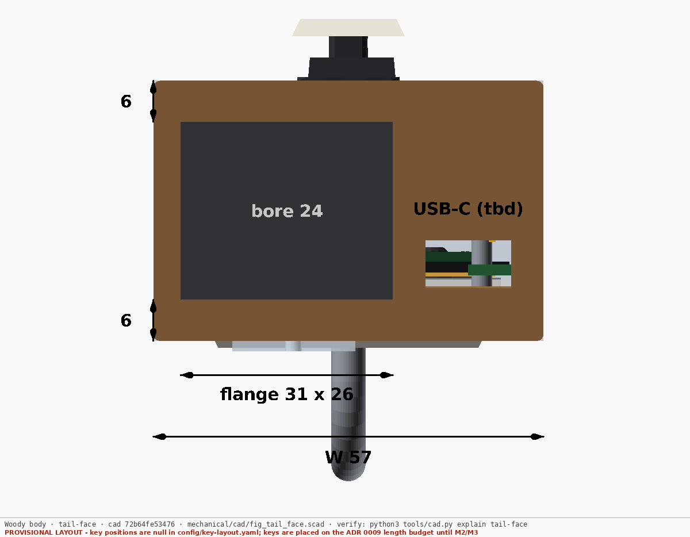

# Instrument body — parametric CAD

> **Status:** first model, 2026-09-26. **Layout is PROVISIONAL**: every key
> position in `config/key-layout.yaml` is still `null` (they are M2/M3
> outputs), so keys are placed on ADR 0009's length budget and every render
> says so in its footer.

The body described in [ADR 0009](../docs/decisions/0009-enclosure-construction.md)
— a laminated stack of flat parts, every layer a 2D through-cut — as an
OpenSCAD model, with renders and cut files generated from it and a ledger that
proves each one still shows the model it names.



## The one rule

**Change the YAML, run the build, commit what it produced.** Never draw a
number into the `.scad`, and never touch a file under `renders/`, `export/`
or `cad/generated/`.

```
config/key-layout.yaml ─┐                           ┌─> renders/*.png   (stamped)
config/body.yaml ───────┼─> cad/generated/params.scad ─> woody_body.scad ─┼─> export/*.dxf    (cut files)
datasheets/…  (STEP, DXF)─> cad/vendor/*.stl ────────┘                     └─> drc.echo        (design rules)
                                                         every arrow fingerprinted in OUTPUTS.csv
```

```
python3 tools/cad.py build          # regenerate params, rebuild whatever is stale
python3 tools/cad.py check          # exit 1 if any output no longer matches its sources
python3 tools/cad.py explain hero   # which input moved, and the commit it was built from
```

`check` runs from the commit gate (`tools/check-staleness.py`) and needs
nothing but Python. `build` needs OpenSCAD 2021.01+, `xvfb-run` on a machine
without a display, Pillow (for the stamp), and gmsh (`pip install gmsh`, plus
apt `libxft2`) to mesh the vendor STEP files.

## How staleness is tracked

A picture cannot be grepped, so no forbidden pattern will ever catch a render
of a superseded value. Instead:

- **Every output has a fingerprint**: a hash over its recipe in
  [`outputs.yaml`](outputs.yaml) and the git blob id of **every file it was
  built from**, found by walking `include`/`use`/data-file references from its
  source. The build cross-checks that walk against OpenSCAD's own dependency
  file and refuses to trust a fingerprint the two disagree on.
- **[`OUTPUTS.csv`](OUTPUTS.csv) is the ledger**: fingerprint, the output's own
  hash, and each input's blob id. `check` recomputes all of it. It reports an
  output as **STALE** when an input moved (naming the file), as **edited** when
  the output no longer hashes to what the ledger vouches for, and as an
  **orphan** when a PNG or DXF exists that no spec entry builds.
- **The fingerprint is stamped into every render's footer**, because the reader
  looks at the picture, not the ledger. A render pasted anywhere still says
  `cad <fingerprint>`, and `explain` turns that back into the git commits it was
  built from.
- **A config change is caught before it reaches a picture**: `params.scad`
  must equal what the YAML generates, and `check` lists every output fed by it.
- **Pages here may only show tracked outputs.** An image link in a
  `mechanical/**/*.md` page that is not in the ledger fails `check`.
- **`RECIPE` in `tools/cad.py`** is part of every fingerprint. Bump it when you
  change *how* outputs are made (stamp, mesh settings, render flags) — the
  tool's own source is deliberately not an input, so this is the one manual
  step, and forgetting it was the first bug this pipeline had.

## What is here

| Path | What it is |
|---|---|
| [`cad/woody_body.scad`](cad/woody_body.scad) | The model. Every flat part as a 2D module in its own sheet frame; the assembly places them. `part=` selects one |
| `cad/fig_*.scad` | Figure sources with dimensions and labels, drawn from the same variables as the parts. They sit beside the model because OpenSCAD resolves `import()` against the top-level file |
| `cad/lib/annot.scad` | Dimension and label helpers (from JBrain2's back-plate CAD) |
| `cad/generated/params.scad` | **Generated.** Every number the model uses, with its source and status |
| `cad/vendor/*.stl` | **Generated.** The banked KS-33 and T-Display-S3 AMOLED STEP solids, meshed |
| [`outputs.yaml`](outputs.yaml) | Every output: cameras, defines, paths. The build does exactly this list |
| [`OUTPUTS.csv`](OUTPUTS.csv) | **Generated.** The fingerprint ledger |
| [`drc.echo`](drc.echo) | **Generated.** The design-rule report — read it after every change |
| `export/*.dxf` | **Generated.** One file per flat part, as it goes to the cutter |
| `renders/*.png` | **Generated.** Every image on these pages |
| [DESIGN.md](DESIGN.md) | How the stack is built, where each number comes from, and what the first model found |

## The views

| | |
|---|---|
|  Underside: thumb recesses, spares (magenta), U-bolt, matrix window, service cover |  The stack, pulled apart |
|  Lid off |  The tail from inside |







| | |
|---|---|
|  |  |
