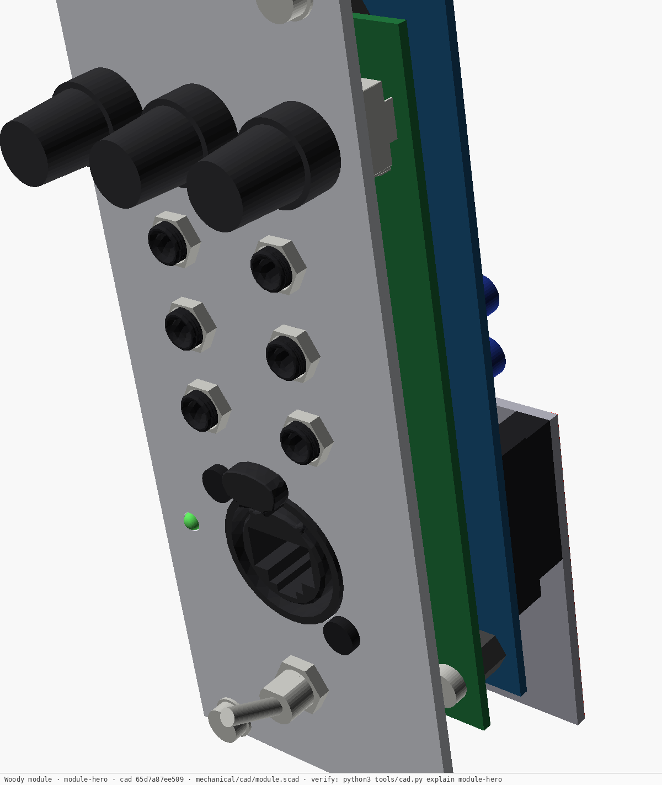
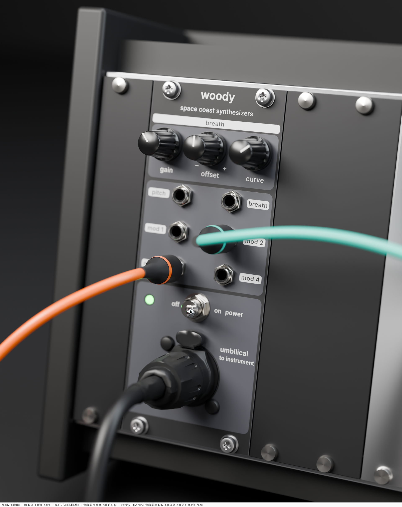
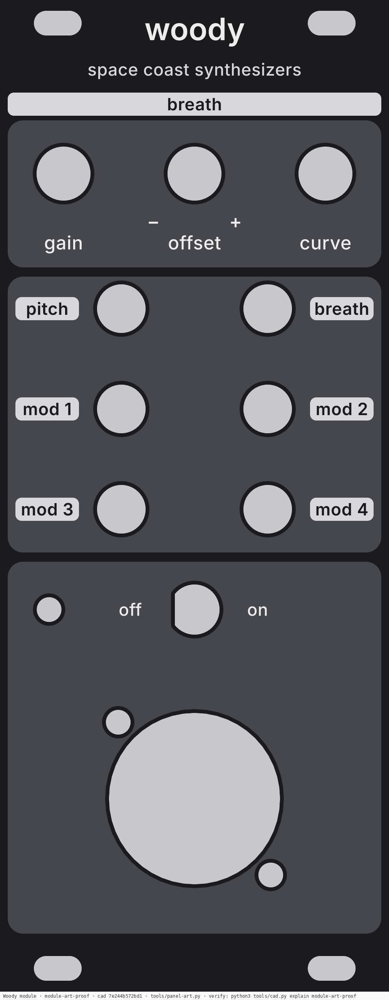
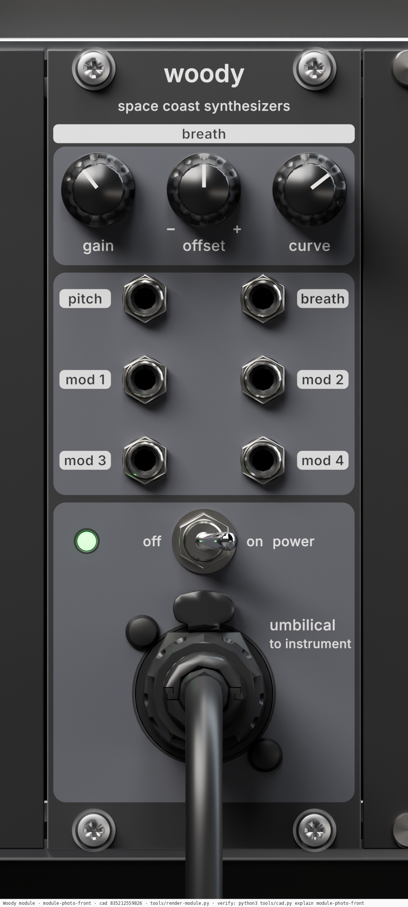
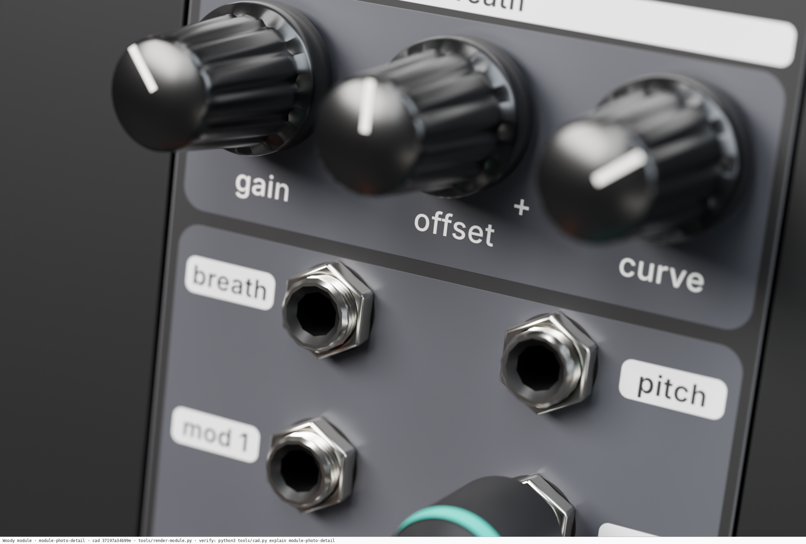
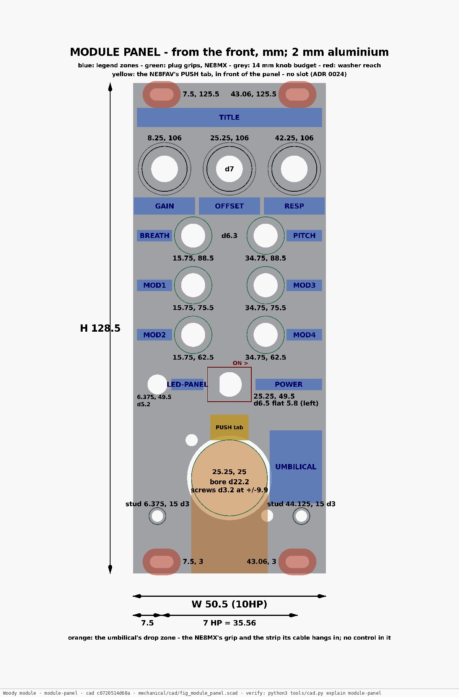
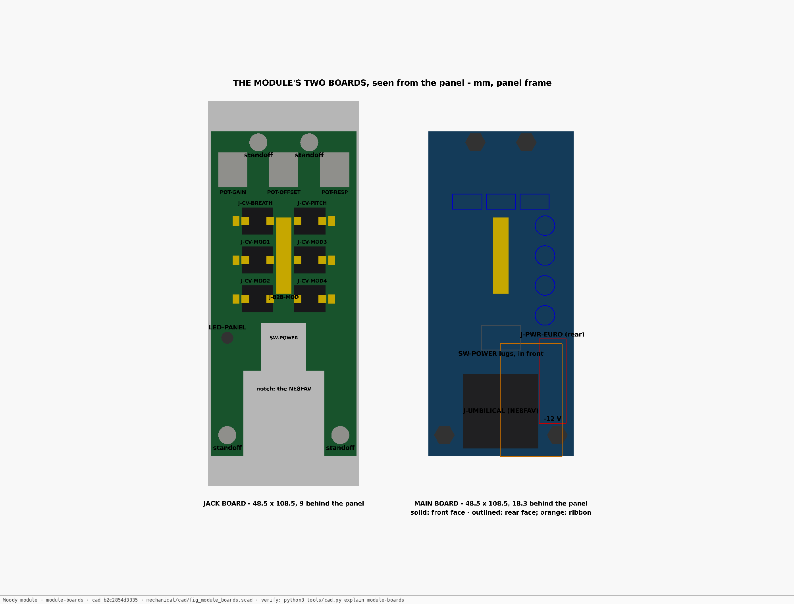
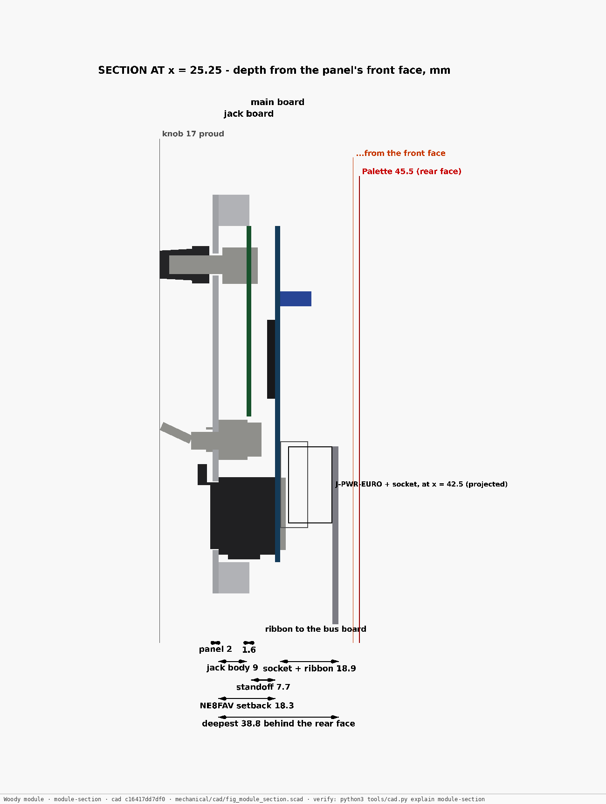
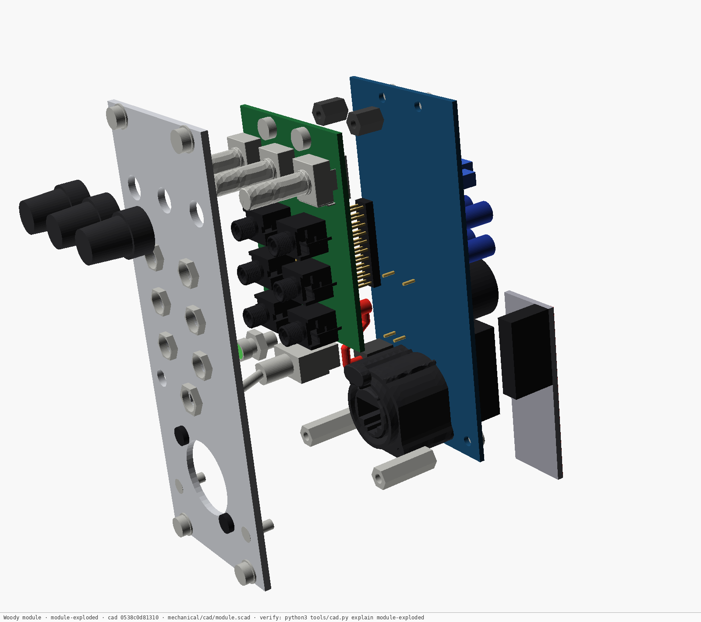
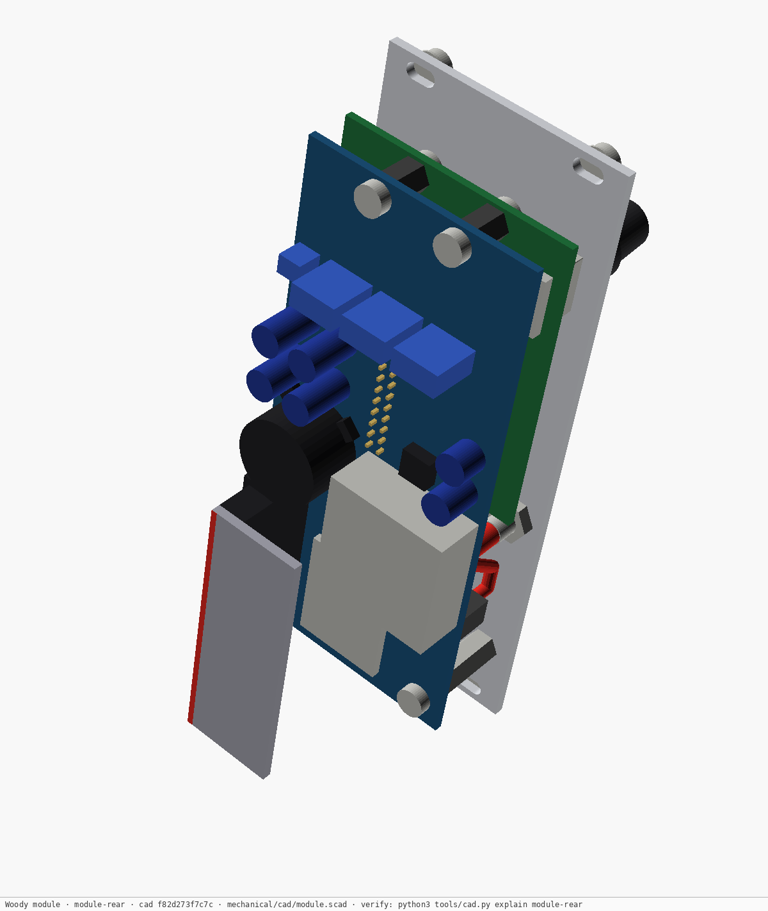

# Eurorack module — parametric CAD

The module's panel, its two boards and every part that sets their positions
and depths, as an OpenSCAD model: [`../cad/module.scad`](../cad/module.scad).
The decisions it realises are [ADR 0023](../../docs/decisions/0023-module-ethercon-and-two-boards.md)
(the NE8FAV, two boards) and [ADR 0024](../../docs/decisions/0024-module-panel-layout-and-stack.md)
(the panel layout and the stack). It goes as far as the line before board
layout: outlines, positions, keep-outs and the cut file, not copper.

**The etherCON is the panel's bottom row** (ADR 0024 point 11, the owner's
instruction of 2026-09-30: *"Power switch should not be underneath the
connector"*). The toggle and the LED are the row above it, so the umbilical's
plug and cable drop below every control. The panel drawing shades that drop
zone, and `drc.echo` holds the rule that keeps controls out of it: *no panel
control under the umbilical: clear of the NE8MX's grip and its cable's drop
zone*, with *the umbilical's plug stands proud of every control* beside it.
Behind the panel, the jack board's notch clears the NE8FAV and steps up
narrower for the toggle's body.

**The toggle throws left–right, ON to the right** (ADR 0024 point 12, the
owner, 2026-09-30: *"to avoid inadvertent triggering"*). One leaf,
`layout.toggle_on`, turns everything that turns with the switch: the panel
hole's D-flat (on the OFF side, the left — NKK's M2011 is ON with its lever
away from the flat), the lever's sweep and the legends derived from it, the
body's terminal field and lugs, the jack board's step and the main board's
wiring keep-out. The panel drawing outlines the sweep and marks ON.



## The one rule, as for the body

**Change `config/module.yaml`, run the build, commit what it produced.** Never
type a number into a `.scad` file, and never touch a file under `renders/`,
`export/` or the generated parameters. The NE8FAV's numbers are not in
`config/module.yaml` at all: its leaves say `ref: config/body.yaml:ethercon.*`
and `tools/cad.py` copies them, so the connector is dimensioned once for both
ends. A leaf that names a register figure (`figure: panel-width`) fails the
build if the figure moves.

```
config/module.yaml ──┐  (+ config/body.yaml ethercon.*, config/figures.yaml)
                     └─> cad/generated/module-params.scad ─> cad/module.scad ─┬─> module/renders/*.png   (stamped)
datasheets/… (STEP) ─> cad/vendor/{ne8fav,pj398sm,r0904n}.stl ────────────────┤─> module/export/*.dxf    (cut files)
                                                                               ├─> module/drc.echo        (design rules)
                                                                               └─> module/clash.txt       (interference)
                                        every arrow fingerprinted in module/OUTPUTS.csv
```

```
python3 tools/cad.py build                       # everything stale, body and module
python3 tools/cad.py build module-drc module-clash
python3 tools/cad.py check
```

The module is **a separate model with its own spec and ledger**
([`outputs.yaml`](outputs.yaml), `OUTPUTS.csv`), built by the same tool as the
body (`mechanical/README.md` says how staleness is tracked). A change to the
body never marks a module picture stale, nor the reverse.

## What is here

| Path | What it is |
|---|---|
| [`../cad/module.scad`](../cad/module.scad) | The model. `part=` selects the assembly, a 2D cut (`panel`, `jack_board`, `main_board`), the DRC or the PCB geometry |
| `../cad/fig_module_*.scad` | The drawings: the panel, both boards, the side section |
| `../cad/generated/module-params.scad` | **Generated** from `config/module.yaml` |
| [`drc.echo`](drc.echo) | **Generated.** Every design rule, `PASS`/`FAIL`/`NOTE`/`INFO` with its measured value. Pages cite rules by name |
| [`clash.txt`](clash.txt) | **Generated.** Every named envelope against every other |
| [`clash-allow.yaml`](clash-allow.yaml) | Interference the design intends, each with its reason (none yet) |
| `export/panel.dxf` | **Generated.** The panel as it goes to the cutter |
| `export/jack-board.dxf`, `export/main-board.dxf` | **Generated.** The boards' outlines, with the standoff holes |
| [`export/pcb-geometry.echo`](export/pcb-geometry.echo) | **Generated.** Where every board-mounted part is, each face's keep-outs and height limits - the board layout's input, in the body's `pcb-geometry.echo` format |
| [`export/panel-art.echo`](export/panel-art.echo) | **Generated.** Every legend and graphics zone's position, every keep-out on the face, where each part sits - the artwork's and the photographs' input (ADR 0026) |
| `art/` | **Generated** by `tools/panel-art.py`: the print PDF and SVG, the proof, the placement report, the render textures |
| `blender/studio_small_08_1k.hdr` | The photographs' light probe, banked (Poly Haven, CC0) |
| `renders/*.png` | **Generated.** Every image on this page; `photo-*.png` by `tools/render-module.py` |

The clash check and the DRC use **envelopes** from `config/module.yaml`, not
the vendor meshes (`vendor=false`); the meshes are for the pictures. So a
clean clash is only as good as the envelopes, and several are `tbd` — the DRC's
first line lists each one in play.

## The panel's print (ADR 0026)



The printed graphics follow Pittsburgh Modular's dark Lifeforms language —
black anodise, three grey islands, a light-grey header pill, white lowercase
Inter, every jack's word knocked out of a light-grey pill (they are all
outputs), no scales but OFFSET's − and + — as an original design
([ADR 0026](../../docs/decisions/0026-module-panel-graphics.md)). Nothing in
it is drawn by hand:

```
config/module.yaml art.*  ──┐
cad/module.scad (part=art) ─┴─> export/panel-art.echo ─┐   every zone's position, every keep-out, every part
export/panel.dxf ──────────────────────────────────────┼─> tools/panel-art.py ─┬─> art/panel-art.pdf   spot inks, to the panel maker
datasheets/fonts/Inter-*.ttf ──────────────────────────┘                        ├─> art/panel-art.svg   the master, Inkscape layers
                                                                                ├─> art/panel-art.png   the proof
                                                                                ├─> art/panel-art-check.txt   every word's zone and air
                                                                                └─> art/tex-*.png ─> tools/render-module.py ─> renders/photo-*.png
```

- `module.scad` derives the islands, the `breath` header pill, the
  OFFSET marks and the name between the top screws from the layout, and `drc.echo` checks each
  (`art:` and `art zone:` rules). The legend zones ADR 0024 already had are
  exported with their positions too.
- `tools/panel-art.py` sets the words and **fails** on any placement rule;
  its report, `art/panel-art-check.txt`, gives every word's ink box, its air
  inside its zone, its distance to a cut and to the nearest keep-out, its
  stem, and each ink pair's contrast. The words themselves are
  `config/module.yaml` `art.text.*` — the knobs read *gain, offset, curve*.
- **To the panel maker**: `export/panel.dxf` (the cut) with
  `art/panel-art.pdf` (UV print, "use white ink" and "underprint white" on).
  A 1:1 paper print of the PDF over a cut template first, then one proof panel.



The photographs are Cycles renders of a scripted scene
(`tools/render-module.py`, Blender as a Python module): the panel is
`panel.dxf` extruded, the print is the same textures at
`art.texture.px_mm`, the NE8FAV, the NE8MX and the jacks are the banked
vendor solids, and the knob, the toggle's lever, the nuts, the patch cables
and the case are modelled from `config/module.yaml`. The studio light probe
is Poly Haven's *studio_small_08* (CC0, Sergej Majboroda,
https://polyhaven.com/a/studio_small_08), banked at 1k in `blender/`. Each
render takes tens of minutes on a CPU; `cad.py build` redoes one only when
something it shows moved.

| | |
|---|---|
|  Straight on — for checking the print against the parts |  The breath knobs, the OFFSET marks, the pitch and breath pills |

## The views







| | |
|---|---|
|  The stack pulled apart |  From behind: the power header, its socket and the ribbon folded down, `U-ISO` (RP20-2412SAW, ADR 0027) with its filter parts, the trimmers and bulk caps (envelopes) |
